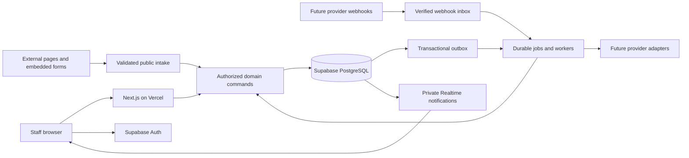

# 80/20 CRM architecture

Status: proposed for client review. Architecture only; no application, migrations, credentials, provider connections or deployment have been initialized. Date: 2026-09-21.

Implementation update, 2026-09-22: Phases 1, 2, and 3 have been implemented and verified. The original design below remains the contract for later phases. Verification reports are recorded in [PHASE_1_VERIFICATION.md](PHASE_1_VERIFICATION.md), [PHASE_2_VERIFICATION.md](PHASE_2_VERIFICATION.md), and [PHASE_3_VERIFICATION.md](PHASE_3_VERIFICATION.md). Realtime is disabled/unpublished; external providers remain disconnected.

## 1. Authority and scope

The requested `docs/client-requirements.pdf` does not exist. The only supplied source is [`../80-20_CRM_Simple_Developer_Brief_Updated.pdf`](../80-20_CRM_Simple_Developer_Brief_Updated.pdf), **8 pages, all read**, SHA-256 `A067692B2F2BDFBB697FE717C617510F9AAE9962A43CC1B8B2DFAD5E7F15F90A`. This design treats that brief as the client source pending confirmation that it is the intended PDF. The original remains unchanged. The user's additional Meta attribution, VSL analytics, technology and phase restrictions supplement it and override its timing where necessary.

Build an internal standalone sales CRM: capture → assign → contact → follow up → book → show → close/lost/nurture → revenue and EOD. Do not build a dialer, funnels/pages, website builder, social scheduler, courses, reputation management or full accounting. External VSL/ASL/thank-you pages remain external; CRM supplies forms and a future tracking interface. A Call action records a manual attempt or eventually opens an authorized external tool; it does not place calls.

The PDF requires working Calendly, email, SMS, WhatsApp and campaigns for final acceptance. Those remain required delivery milestones, but **no external provider integration occurs in this phase**. A later core-only release cannot claim full PDF acceptance. All defaults below are proposals, not invented client decisions. See [DECISIONS.md](DECISIONS.md) for unresolved approvals.

## 2. System design

Use a modular monolith: Next.js App Router, TypeScript and Tailwind on Vercel; Supabase PostgreSQL as system of record; Supabase Auth for identity; Supabase Realtime for authorized change notifications. Domain commands commit transactional state, activity, audit and outbox records together. Workers process durable jobs outside interactive requests. No provider-specific behavior in core entities.



Vercel hosts the web app, finite ingestion handlers and bounded worker batches. PostgreSQL stores the queue and leases. A Vercel Cron invocation initially wakes a dispatcher; it is not the durable queue or a precise scheduler. Before provider activation, validate reminder latency against actual plan limits; use a dedicated continuously running worker if required. No work relies on process memory, a timer after returning HTTP, or filesystem persistence. Keep web, database and worker regions close, subject to residency approval.

## 3. Next.js structure and contracts

Proposed structure, to create only after approval:

```text
src/app/(auth)/                     login, invitation, recovery
src/app/(workspace)/[workspace]/    dashboard, leads, pipeline, conversations,
                                   tasks, campaigns, forms, eod, reports, settings
src/app/api/public/                published forms, consent-aware VSL intake
src/app/api/v1/                    authenticated external lead receiver
src/app/api/webhooks/[provider]/   provider verification and durable inbox
src/app/api/internal/jobs/         authenticated dispatcher endpoint
src/modules/<domain>/              commands, queries, policies, types, validation
src/server/                       auth, database, telemetry, configuration
src/integrations/                  contracts and later provider adapters
src/components/                   shared accessible presentation components
supabase/migrations/              reviewed SQL, constraints, RLS and functions
supabase/tests/                    database and RLS tests
tests/                            unit, integration, browser, contract tests
```

Server Components fetch scoped DTOs. Client Components handle interactions such as drag-and-drop, forms and authorized live invalidation; they never decide access. Server Actions handle staff commands, Route Handlers handle public/API/webhook traffic. Both invoke the same server-only application services and transactional database functions. Enforce runtime validation at every boundary; TypeScript alone is insufficient. Make command input explicit: aggregate ID, expected version, idempotency key and action-specific fields. Derive actor and membership from verified authentication, never from submitted user/role values.

Use request-scoped Supabase clients with user JWTs for normal access. Transactional commands use narrowly granted database RPC functions; revoke direct writes to invariant-bearing tables. Elevated worker access is isolated. Do not globally cache tenant records or user clients. Personalized pages/responses use private/no-store behavior; cache only explicitly public form definitions and authorized report projections with scope-aware keys. Invalidate after commit; stale drag actions return conflict and reload.

Next.js requires authorization at each action/entry point; routing guards alone do not secure commands. See [Next.js authentication](https://nextjs.org/docs/app/guides/authentication). Pin supported package versions and runtime only at implementation kickoff after advisory review.

## 4. Authentication and authorization

Propose invitation-only Supabase Auth. A login identity is not a workspace entitlement. `memberships` is the authoritative active role record; `team_memberships` scopes managers. Invitations are single-use, expiring and bound to the intended email/workspace. Password reset and email-link redirects use allowlists. Require MFA for Owner/Admin and privileged settings/exports; decide other roles' requirement before rollout. Last active Owner cannot be removed or demoted. An Owner is the `admin` role plus an ownership flag, protecting ownership transfer and workspace deletion.

Session handling uses the supported Supabase SSR approach, verified tokens, secure cookies and session refresh. Never trust locally decoded unverified JWTs or editable user metadata for role. Check active membership per request and per sensitive command, so a stale JWT cannot preserve revoked permissions. User deactivation revokes sessions and assignments are explicitly handed off; historical credit remains.

Proposed permission matrix: `workspace` = all records in own workspace; `team` = managed teams; `assigned` = current setter/closer or explicit lead access grant. No role crosses workspace boundaries.

| Capability | Admin/Owner | Manager | Setter | Closer | Read-only |
|---|---|---|---|---|---|
| Read leads/history/messages | Workspace | Team | Assigned | Assigned | Explicit reporting scope |
| Edit lead contact/tags/notes/tasks | Workspace | Team | Assigned | Assigned | No |
| Log contact and stage progress | Workspace | Team | Assigned non-financial actions | Assigned non-financial actions | No |
| SET/confirm attendance | Workspace | Team | Assigned SET/confirm | Assigned SET/confirm/SHOW/no-show | No |
| CLOSE, record payment, LOST | Workspace | Team | LOST; no CLOSE/payment | Assigned | No |
| NURTURE/follow-up | Workspace | Team | Assigned | Assigned | No |
| Reassign leads/closers | Workspace | Team and eligible members | Only choose eligible closer during SET | No general reassignment | No |
| Send one-to-one messages | Workspace | Team | Assigned, connected channels | Assigned, connected channels | No |
| Publish forms/campaigns/sequences | Workspace | Team, approved channels | No | No | No |
| EOD | All | Team and own | Own | Own | Scoped reports |
| Reports and drilldown | Workspace | Team | Own credit, visible lead detail | Own credit, visible lead detail | Explicit scope |
| Bulk export/merge, refund/correction | Workspace | Team with explicit capability | No | No | No |
| Users, secrets, consent policy | Workspace | No role escalation or secrets | No | No | No |

Roles and team visibility need client approval. A rep can retain own historical numerical credit after reassignment, but no longer gets current lead PII without an access grant. Manager drilldowns expose supporting leads only within authorized teams. If the client requires reps to drill into reassigned leads, add a deliberate time-limited grant rather than weakening RLS.

### RLS enforcement

Every tenant table has a non-null workspace ID, RLS enabled, restrictive grants and same-workspace composite foreign keys. `USING` controls existing-row access and `WITH CHECK` prevents writes into unauthorized workspace/ownership. Lead children inherit `can_read_lead`/`can_work_lead`; child IDs or knowing a UUID never confer access. Managers use a lead's accountable team, not an arbitrary relationship to any user. Unassigned leads remain manager/admin-visible; reps cannot claim them without an approved claim policy.

Use small private-schema helpers for membership and team checks, with fully qualified names, fixed empty search path and a non-login owner. Any SECURITY DEFINER command explicitly rechecks caller, role, tenant, field permission and expected version; revoke PUBLIC execute and grant only intended roles. Avoid recursive membership RLS. Users cannot directly mutate memberships, credits, event journals, financial ledgers or metrics. Views must preserve invoker RLS or be private service-only projections with separately enforced authorized output. Column-sensitive data uses DTOs/explicit grants, not RLS alone. Validate each new table, view, RPC, partition and storage bucket in CI. See [Supabase RLS guidance](https://supabase.com/docs/guides/database/postgres/row-level-security).

Anonymous clients have no direct database reads/writes to leads or telemetry. Public form definitions expose only a safe projection; intake uses a scoped server command. Webhook/worker service access bypasses RLS where privileged: isolate it, never expose the credential and require trusted workspace resolution and explicit tenant predicates. Apply equivalent authorization to reports, downloads, search, exports and Realtime.

Realtime initially sends minimal per-user invalidation signals over private channels. Clients refetch through current RLS; no contact/message data in notification payloads. This limits stale channel membership exposure after reassignment. Restrict channel subscriptions through `realtime.messages` policies and revoke/reconnect on membership changes. Do not subscribe to raw VSL events or webhook payloads. Realtime Broadcast has its own authorization rules: [Supabase Realtime authorization](https://supabase.com/docs/guides/realtime/authorization).

## 5. Lead identity, assignment and sales state

One canonical person record (`leads`) per workspace, with separate identities, sales journeys and deals. Default one active journey per lead; completed journeys remain when a person returns. The current pipeline/stage is a journey projection, avoiding destruction of earlier outcomes. No cross-workspace deduplication.

Identity precedence: known provider mapping or signed CRM reference; otherwise normalized exact email/phone candidates. Normalize phone to E.164 only with a reliable country context; retain raw input and flag ambiguous numbers. Normalize email whitespace/domain and use a documented case-insensitive matching policy; never remove plus tags or dots. Names, cookies, IP addresses and fuzzy similarity never auto-merge people. If all trusted matches identify one canonical lead, attach the intake. Conflicting phone/email matches, shared addresses or unverified claims go to a restricted resolution queue; store the original intake once, do not overwrite PII or return existing lead details publicly. A submitted email is not proof of identity and cannot authorize viewing or updating sensitive fields.

Lock identity keys in stable order and use unique claims plus transaction retries for concurrent creation. Multiple contacts may share an identity value; only explicitly safe identities receive a unique active auto-match claim. Manager merge locks both records, chooses a survivor, reparents compatible operational children, unions suppression conservatively, preserves source IDs and retains an immutable merge map. Historical facts retain original IDs and resolve through the canonical map; do not rewrite their meaning or delete credit. Conflicts in active journeys, deals or identity claims require explicit resolution. Disable destructive automatic unmerge; corrections require a reviewed recovery process.

Assignment rules are versioned by intake source/form/pipeline/team, with manual, fixed-user or round-robin policies. Lock the round-robin cursor and validate active member/team eligibility. Record why, rule version, actor and previous/new setter and closer. Unavailable assignees go to a visible team queue with alert and next-action SLA; never silently drop a lead. Setter and closer assignments are independent. Historical SET, SHOW, CLOSE and payment credit is snapshotted at event time; reassignment does not rewrite it.

Seed proposal follows PDF p.2: New Lead, Contacted, Call 1, Call 2, Call 3, Call 4, Nurture, Meeting Booked, Confirmed, Showed, Follow-Up / Decision, Closed Won, Closed Lost. Stable semantic codes drive behavior; labels/order are configurable. The journey mentions No Show although the stage list omits it: model it as meeting attendance with a follow-up action pending stage clarification. Calling stages log manual attempts, not dialer functionality.

Drag-and-drop invokes the same validated commands as quick actions. Moving to a terminal/booking stage cannot bypass required meeting, reason or deal fields. An action and stage transition execute once in one transaction with activity, credit and reporting facts. SET uses a meeting identity, not each click, as the count key; SHOW requires an attended meeting; CLOSE requires a deal and currency, allowing zero cash received. LOST requires a reason. NURTURE requires a next follow-up or active sequence enrollment. Reopen is a separate permissioned event. Persist version checks to reject simultaneous conflicting moves.

## 6. Lead workspace features

Notes retain author/time, revisions and pin/important flags. Edits create revisions; deletion hides content via a recorded redaction action. Important conversation markers reference specific messages or threads; they do not duplicate text. Activities are append-only business facts; current state remains normal relational records, so this is not full event sourcing. Corrections append compensating facts with references. Events have semantic name/version, aggregate/version, occurred/recorded time, actor/system origin, correlation/causation and minimal payload. Store PII content separately to allow erasure without falsifying historical metrics.

Tasks include title, due UTC instant, display timezone, priority, assignee, lead/journey, source and status. Complete/cancel/reopen are distinct events. Today/Upcoming/Overdue use workspace reporting timezone unless a view explicitly shows personal timezone. A derived next-action projection chooses the earliest pending actionable task or sequence step, not a manually competing date on the lead. Managers see active journeys with no next action. Scheduling preserves intended local time through DST with an explicit ambiguous/nonexistent-time policy.

Meetings separate booking lifecycle from attendance. Model provider occurrence/invitee IDs, event type, closer mapping, original and current schedule, reschedule chain, cancellation reason, attribution and setter/closer credit. One booking can have multiple invitees; each lead meeting is distinct. Use authenticated/signed correlation where available before cautious identity matching. Rescheduling creates a revision and supersedes pending reminders; it does not create another set by default. Cancellation never erases booking history. A late booking must not regress an already closed journey. Attend/no-show is a CRM fact, not inferred merely from calendar time.

Confirmation, updated confirmation, reminders (example 24h/1h), cancellation and no-show follow-up are versioned automation rules. Each message is persisted before send and linked to trigger/meeting/schedule revision. Before dispatch recheck current schedule, attendance, suppression, consent, enrollment, channel and template eligibility. Obsolete reminders are cancelled; late reminders follow a defined window rather than sending all missed reminders at once. Confirmation channels and timings require client approval.

Conversations are channel/account/participant threads, linked to the lead. Messages include inbound/outbound direction, actor, content reference, provider mapping and immutable status receipts. Provider support determines available delivery, read, open/click and reply signals; unsupported metrics are null/unavailable, not zero. Store message templates and versions; WhatsApp approval/window restrictions are adapter capabilities to validate later. Replies route by provider thread/message ID and identity; ambiguous inbound messages stay in a restricted inbox. Manual historical conversation entries are labeled manual. DNC still permits storing lawful inbound messages but blocks outbound attempts according to policy.

Forms have draft/published immutable versions, typed questions and validation: name, email, phone, text, long text, number, dropdown, multiple choice, checkbox, hidden fields. Store original answers with the exact version, consent evidence, attribution and lead association; custom lead fields are typed definitions with validated values. Publication validates target stage, tags, assignment policy and redirect allowlist. Embeds post to a rate-limited endpoint with scoped form token, allowed origin and size limits; origin/token is not an authentication guarantee. Never trust hidden workspace/role/assignee values. Public responses avoid identity enumeration. Redirect only after durable intake, with a short-lived opaque correlation token if supported; never put lead PII or service keys in URLs. External forms and Meta lead receivers use authenticated ingestion contracts. CSV import uses staged rows, mapping/dry-run validation, dedup review and row-level idempotency; formula injection is escaped on export.

Campaigns are distinct from Meta advertising campaigns. Store saved audience definition and a snapshot of recipient identities at launch, template version, timezone and schedule. Authorization limits both audience selection and individual recipients. Recheck audience eligibility, consent, DNC and channel availability at send time. Broadcasts support immediate, scheduled and throttled batches; sequences have immutable published steps, enrollments and step executions. Stop/pause on reply, booking, conversion, opt-out or manual action according to explicit rules. Version edits do not silently change in-flight enrollments. Prevent duplicate sends by execution keys, enforce provider quotas and show partially delivered/blocked/unknown states honestly. No fake connected or sent state when adapters are unavailable.

Deals and cash are different. A deal records contractual value/currency/status and outcome credit; a payment ledger records receipts, refunds and corrections with evidence and external reference when present. Use integer minor units, currency metadata and no floating-point sums. CLOSE can record a real manual receipt atomically if supplied; zero initial cash is valid. Installment plans and due items are scheduling records, not collected cash. Remaining balance is a projection from value/adjustments and net receipts; overpayment becomes explicit credit. Do not sum currencies without an approved FX method; default reports group by currency. No payment gateway or accounting system is implied.

## 7. Reporting, EOD and attribution

Immediate operational metrics read committed facts and projections; heavier cohort/ad/video rollups are asynchronous with `as_of`, lag and formula version. Every KPI links to supporting fact IDs and authorized lead/deal/meeting rows, not a separate inconsistent query. Snapshot credit at event time; preserve cohort membership and timezone. Distinguish booking date, meeting date, close date and cash receipt date. Imports/backfills use occurred time for business reporting and recorded time for freshness; never silently rewrite submitted EOD.

Metric proposals (client approval required): contacted = distinct leads with qualifying manual contact or accepted outbound attempt, with successful contact reported separately; follow-ups completed = unique task completion; sets = first valid booking per meeting chain; confirmed = unique meeting confirmation; shows/no-shows = final attendance per meeting; offers = explicit offer-issued/opportunity-advanced fact (not every stage move); closes = distinct won deals; value = won deal value net of approved corrections; cash = receipts less refunds by receipt date/currency; nurture/lost = qualifying journey transitions; overdue = open tasks due before snapshot cutoff. Show rate = shows/(shows + no-shows), excluding cancelled/future/unknown attendance, with unresolved counts shown. Close rate = won sales opportunities / eligible sales opportunities for an explicitly selected cohort; do not mix today's sets with today's closes. Campaign open/click metrics are provider-reported and may include privacy proxies/bots.

EOD is one rep/business date with revisions. Generate counts and immutable supporting fact membership as of a cutoff; rep adds only important leads/conversations, objections, blockers, tomorrow priorities and optional notes. Submission freezes the revision. Late facts create a suggested amended revision with visible delta, never silently alter a submitted report. Manager compares setter/closer rows and drills into supporting facts. Current overdue snapshot remains distinct from cumulative daily completion counts.

Meta chain: **Campaign → Ad Set → Ad/Creative → VSL → Form → Lead → Calendly Booking → Setter/Closer → Won/Lost/Nurture → Revenue**. Persist both internal and provider identifiers with provenance, timestamps, raw UTM/source/referrer fields, landing page and supported click/browser identifiers (e.g. fbclid/fbc/fbp), subject to consent. External IDs are opaque text. Meta Ads, Lead Ads, Pixel, Conversions API and messaging are separate adapter capabilities; CRM ownership does not depend on their availability.

Every eligible visit/intake/booking contributes an immutable touchpoint. First-touch and latest-touch are derived versioned selections ordered by eligible occurrence time with deterministic ties; original intake provenance remains unchanged. Preserve initially recorded first touch and append a revision when reliable late evidence changes analytical first touch. Do not replace fields destructively. Unknown/direct remains explicit and does not erase a known latest marketing touch unless the selected model says so. Snapshot attribution at booking, deal won and payment so later visits cannot rewrite historical revenue attribution. Recompute only under a versioned restatement. Define windows and direct-traffic treatment before rollout. Separate observed source facts from inferred attribution and Meta-reported conversions; attribution is not proof of causation. Pixel and CAPI future emissions share a stable event ID for provider deduplication; consent and hashing requirements are adapter gates, not authorization to transmit now.

## 8. Anonymous tracking and VSL analytics

External pages use a future first-party embed/tracking SDK with a public site key scoped to allowed domains and assets. A pseudonymous visitor token is random, scoped to workspace/site and rotated/expired per policy; it is not a CRM credential. Browser/site sessions and video playback sessions are separate. Do not fingerprint, stitch by IP, or promise tracking across unrelated domains. Cross-domain continuity needs a short-lived signed transfer token and compatible consent; otherwise show disconnected visits. Tracking must respect the saved policy version and consent purpose at collection and processing. Proposed default is no nonessential persistent tracking or identity association until allowed consent; jurisdictions and lawful basis remain a release gate.

After form submission, consume a scoped association proof bound to the visitor session, form and consent record. Create a reversible, provenance-bearing visitor-to-lead link; never expose lead details to the visitor or link by guessed email. Association only covers the permitted session/time interval. Multiple people using one device do not automatically share all historical behavior; conflicting links are quarantined. Withdrawal stops future tracking/association and triggers retention/erasure jobs as policy requires.

VSL assets have immutable versions and duration in integer milliseconds. Track viewer/session, play/pause/resume/seek start/seek end, heartbeat, rate change, visibility/buffering, end and replay. Each event carries client event UUID, session sequence, client wall time, monotonic elapsed time, server received time, position, playback rate and consent context. The server validates batches, bounds, order, duration, rate and plausibility; untrusted browser events are analytical evidence, never billing or trusted conversion evidence.

**Watched range algorithm:** between successive validated samples, credit a half-open interval `[previous_position, current_position)` only when the session was playing, not buffering, and forward media progression matches elapsed monotonic time × playback rate within a documented tolerance. Cap credit to the configured heartbeat interval plus tolerance (proposal: 5 seconds + 2 seconds). A seek, discontinuity, missing boundary, excessive gap, negative clock delta or impossible rate ends the segment; begin a new segment only after a new playing anchor. Never bridge seek start and seek end, even if a seek event was lost: discontinuity checks still reject the jump. At pause/end flush only a validated continuous final segment. Seeking to the end alone earns no completion.

Store validated per-pass segments and compute union intervals separately. Total watch time = sum of accepted active elapsed time (replays included); total media coverage time = sum of segment media durations; unique watch time = length of interval union. These differ at non-1× speed and must be labeled. Completion percentage = unique media coverage / asset-version duration, capped at 100%. `ended` is an event; proposed completed qualification is ≥95% unique coverage, explicitly configurable. Replays are repeated coverage of an already watched interval, not seeks alone. Across multiple tabs compute session metrics independently; viewer-level unique coverage unions intervals and viewer wall-clock watch time unions overlap rather than double-counting concurrency.

Retention graph: for each asset-version bin, distinct eligible viewers (or playback sessions in a separately labeled view) who watched any portion / distinct eligible viewers who played. Show denominator and bin width. Coverage-weighted graphs can additionally display watched fraction within a bin. Heatmap stores watched milliseconds, distinct viewers/sessions and repeated milliseconds per bin; repeated coverage is measured against previously accepted coverage for that same aggregation identity. Drop-off uses last valid position of sessions with no further activity after a grace period (proposal 30 minutes), excludes completed sessions and labels censored/in-progress sessions. Resume before expiry updates the session; later sessions are separate. Video duration/version changes never blend incompatible bins. Deduplicate and reorder events within a bounded lateness window; recompute affected session/bins for accepted late data, version aggregates and never increment metrics blindly on retry.

## 9. Webhooks, jobs and delivery safety

Provider adapters implement: connection capabilities, verify raw webhook, normalize event, fetch reconciliation state, send command, interpret receipts and classify errors. Core receives versioned neutral envelopes; provider raw payloads stay encrypted/restricted with short retention. Connections resolve workspace from trusted registered credentials/account identifiers. Never accept caller workspace ID as authority.

Webhook ingress: bound body size → capture exact raw bytes → verify provider-specific signature/challenge, timestamp/replay rules and connection binding → atomically insert inbox and job → acknowledge accepted only after durability. Duplicate verified event returns success only if already durable. Invalid verification returns rejection without queuing. Temporary storage failure returns retryable error. Provider challenge endpoints are separate and cannot insert business events. Algorithms and retry semantics must be checked against provider documentation during that later phase; no generic HMAC assumption across all providers.

Uniqueness: workspace + connection + provider event ID; where absent, use an adapter-defined stable semantic identity or canonical payload hash with documented collision/replay limitations. Store hash to detect reused event IDs with different bodies. Processing is at least once. Each domain side effect has its own semantic key and transaction; inbox dedup alone is insufficient. Handle out-of-order receipts/lifecycle events with provider revision/timestamp plus state-transition rules and reconciliation, rather than arrival-order overwrite.

Transactional outbox couples state changes to eventual work. Jobs have run time, state, attempt count, lease owner/expiry, fencing generation, heartbeat, error class and dedup key. Claim small batches with `FOR UPDATE SKIP LOCKED`; expired leases can be reclaimed. Mark completion only with the current fencing generation. Exponential backoff with jitter, Retry-After, per-provider/account rate limits, workspace fairness, capped retries and dead-letter review are mandatory. Authentication errors pause the connection and notify; invalid requests fail permanently; timeouts/429/5xx retry when safe.

Outbound delivery has an unavoidable ambiguity: provider accepted a message but response was lost. Use provider idempotency when available and a stable operation ID; otherwise mark `unknown`, reconcile using provider reference/history and require review if unresolved. Never blindly resend non-idempotent operations or claim exactly-once external delivery. Recheck suppression immediately before crossing the provider boundary. A concurrent opt-out cannot recall an already transmitted message; retain timestamps/evidence and cancel all remaining queued sends.

Cron wakes may overlap or be delayed, so database leases and keys protect work. See [Vercel Cron management](https://vercel.com/docs/cron-jobs/manage-cron-jobs) and [timing constraints](https://vercel.com/docs/cron-jobs/usage-and-pricing). A watchdog alerts on oldest queued job, lease expiry and missed dispatch; reconcile webhook gaps and delivery uncertainty periodically once integrations exist.

## 10. DNC, security, errors and operations

Suppression supports workspace-wide person DNC plus channel/identity/purpose-specific unsubscribe, complaint, hard bounce and provider blocks. Most restrictive applicable rule wins. Keep evidence, scope, origin and timestamps; fresh imports, merges and a new campaign cannot erase suppression. Re-opt-in is a permissioned evidence-bearing action, not a checkbox override. Separate marketing permission from transactional permission; do not assume reminders bypass DNC. Suppression lookup uses normalized identity and an HMAC where retention policy requires minimizing contact data; key rotation must preserve lookup compatibility. Provider opt-out events apply with priority and cancel pending work. Validate per-channel law, consent and message windows before activation.

Audit logs cover authentication-sensitive events, membership/role changes, assignments, merges, exports, redactions, settings, credential lifecycle, financial corrections and administrative replay. Business activities power lead history; audit is a separate restricted security journal. Application roles cannot update/delete journals. Database operators can ultimately alter a database, so do not call this absolute immutability: optional independent append-only export improves tamper evidence. Privacy erasure uses a privileged audited workflow with tombstones and de-identified facts, not blanket cascading deletion of revenue history.

Errors use typed codes (`validation`, `unauthenticated`, `forbidden`, `conflict`, `rate_limited`, `dependency_unavailable`, `internal`) and safe messages plus correlation ID. APIs map to appropriate HTTP statuses; UI can retry a known command key but never turn failure into success. Financial and lifecycle commands roll back entirely on partial database failure. Public intake returns generic accepted/pending language without disclosing identity matches. Disconnected providers appear unavailable, not simulated.

Structured logs/traces propagate request, command, event, job and provider operation IDs. Log metadata, not message bodies, tokens, form answers, phone/email or raw payloads. Capture error rate/latency, queue age, retry/dead-letter counts, dedup conflicts, RLS violations, webhook rejection, reconciliation gaps, delivery uncertainty, reporting lag and VSL ingestion/invalid-range rate. Track security events separately; bound retention and access. Alerts have named owners and runbooks for provider outage, backlog, breach, restore, failed migration and consent incident.

Threat controls: parameterized SQL and allowlisted dynamic filters; HTML sanitization and escaped templates; CSP, frame policy for embeds and safe URL redirects; CSRF/origin checks for session-authenticated mutations; payload/rate/batch quotas and abuse controls for public intake; SSRF protection for configured callback/media URLs; encrypted connections/secrets; minimally scoped provider tokens; secret scanning and dependency review. No arbitrary remote URL fetching from forms. Restrict exports, log access and mask unnecessary contact data. Future attachments use private storage, short signed URLs, size/type validation and malware checks if attachments are approved; attachments are not a new required feature here.

## 11. Capacity, indexing and production

Use tenant-leading B-tree indexes for lead scope, pipeline stage, assignment, due tasks and timelines; partial indexes for active work; unique indexes for identities/idempotency; BRIN/time partitioning for high-volume telemetry only after sizing. Cursor pagination and projected columns prevent full-table exports or N+1 joins. Never stream raw telemetry via Realtime. Roll up video bins asynchronously, use authorized summary tables for reports, bound date windows and move heavy exports to jobs.

Sizing example, not a client forecast: 10,000 playback sessions/day × 10 minutes × 12 heartbeats/minute ≈ 1.2 million heartbeat events/day before controls. Raw storage, indexes and ingestion can dominate CRM costs. Batch events, bound sampling, adopt approved raw retention and assess partitioning before VSL release. Uniqueness across partitions needs a separate dedup registry or partition-compatible key; see schema. Define actual volumes, budgets and query targets before selecting paid plans.

Separate local/test, staging and production Supabase projects and Vercel environments. Never attach previews to production data/providers. GitHub protected main, review, CI, secret/dependency scans and ordered migration checks gate deployment. Use expand/contract migrations, deploy compatible app versions, backfill in bounded jobs, then remove obsolete fields in a later release. No destructive migration during build. Stage backup/restore drills, access review, DNS/TLS, quotas, monitoring and rollback before launch. Database backup/PITR availability and retention must be verified for the selected paid plan; storage and external configuration need their own recovery inventory. Proposed RPO ≤15 minutes and RTO ≤4 hours require budget and restore verification, not a guarantee.

## 12. 80/20 Outbound boundary

The existing Outbound/Dialer is independently deployed and operated. Do not copy its code, screens, schema, call engine, queues or provider credentials. Future integration uses authenticated versioned API/webhook contracts, external ID mappings and separately granted workspace scopes. CRM owns canonical CRM lead, journey, assignment, consent, deal and revenue state. Outbound owns dial execution and its call/attempt identifiers; it may publish call-started/completed/disposition evidence. CRM accepts idempotent call activity then applies approved transition rules. Source-of-truth and conflict rules forbid the dialer from blindly overwriting CRM stage/ownership. Export only necessary eligible contacts; synchronize opt-outs with priority, provenance and reconciliation. Stop outbound exports when suppression state is stale or authorization is revoked. Integration contract and credentials remain future client inputs.

## 13. Requirement coverage

| Authoritative source | Preserved design | Delivery evidence planned |
|---|---|---|
| PDF p.1–2 §§1–3 | Standalone workspace, ten navigation entries, canonical lead, fields/tags, pipeline stages, excluded products | Core journey and scope review |
| PDF p.3–4 §4 | Eight lead sections, important markers, all quick actions, SET/SHOW/CLOSE/LOST/NURTURE invariants | Transaction and browser scenarios |
| PDF p.4 §5 | Due/upcoming/overdue, no-next-action, nurture | Timezone and permission tests |
| PDF p.4–5 §6 | Calendly match/reschedule/cancel, closer mapping, confirmations/reminders, no-show follow-up and saved history | Later provider sandbox tests |
| PDF p.5 §§7–8 | Email/SMS/WhatsApp, snippets, inbound/status/opt-out, triggers, mass/scheduled/drip campaigns and recipient results | Later channel and sequence gates |
| PDF p.5–6 §9 | Typed forms, attribution, routing/tags, external embed, redirect, external lead receiver | Form intake and abuse tests |
| PDF p.6 §§10–11 | All automatic EOD metrics, qualitative fields, team comparison, every listed dashboard KPI and drilldown | Reconciled metric fixtures |
| PDF p.7 §§12–13 | All five roles, CSV/manual/API/campaign intake, complete sales journey | RLS matrix and journey scenarios |
| PDF p.7–8 §§14–15 | Explicit exclusions and complete acceptance checklist | Final acceptance, not architecture-only claim |
| User additions | Meta graph/first+latest touch, detailed VSL/ranges/retention/replay, anonymous link/consent | Attribution and telemetry test suites |
| User items 1–10 | System/Next.js/database/ER/auth/RBAC/RLS/identity/assignment/pipeline | This document §§2–5 and schema |
| User items 11–20 | Events/notes/tasks/meetings/messages/forms/campaigns/deals/EOD/analytics | §§6–7 and schema |
| User items 21–29 | Meta/attribution/VSL/visitors/webhooks/verification/jobs/DNC/audit | §§7–10 and schema |
| User items 30–37 | Errors/observability/security/performance/env/tests/deploy/Outbound | §§9–12 and companion documents |

Read alongside [DATABASE_SCHEMA.md](DATABASE_SCHEMA.md), [IMPLEMENTATION_PLAN.md](IMPLEMENTATION_PLAN.md), [ENVIRONMENT.md](ENVIRONMENT.md), [TEST_STRATEGY.md](TEST_STRATEGY.md) and [DECISIONS.md](DECISIONS.md).
