# Proposed PostgreSQL schema

Status: logical design for review, not executable SQL or applied migrations. Source/scope: [ARCHITECTURE.md](ARCHITECTURE.md). The tables below deliberately preserve the complete brief and additional tracking requirements; provider-related structures describe future implementation only.

Phase 1 implementation: `supabase/migrations/202609220001_platform.sql` implements only workspaces, global self-visible profiles, memberships, teams/team memberships, capability/report-scope support, private invitations and administrative audit. `crm` and `private` are not Data API schemas; `api` exposes explicit functions. `crm_owner` is NOLOGIN and owns the tables/functions. Global and explicit function-grant revocation is required because schema-only defaults cannot remove PostgreSQL's global PUBLIC EXECUTE default. Deferred lead access grants, privacy, events/jobs and all sales tables are not created prematurely. Global profiles are the documented exception to tenant keys alongside Auth identity; they hold no tenant permissions and are self-read only.

## Conventions and invariants

- UUID primary keys unless a composite key is stated. Every tenant-owned row includes `workspace_id NOT NULL`; every referenced tenant entity exposes `UNIQUE(workspace_id, id)` and children use composite foreign keys. `auth.users` is the global authentication exception. Global static currency metadata has no tenant data.
- Timestamps are `timestamptz` in UTC; business dates are `date` plus IANA timezone and cutoff. Duration/position is nonnegative `bigint` milliseconds; counts are integers. Money uses signed `bigint` minor units with three-letter currency and currency exponent metadata. Provider IDs are text, never assumed numeric.
- Mutable roots include `created_at`, `updated_at`, `created_by_membership_id` and optimistic `version bigint`. Append-only records have `occurred_at`, `recorded_at`, origin and correction references as appropriate. Actor references are nullable for system events and never accept an arbitrary caller-provided actor.
- All FKs are restrictive by default. Archive users/configuration instead of cascading away sales history. Erasure/redaction is a privileged workflow. Nullable relationships are explicitly identified below; unspecified required relationships are NOT NULL. Operational state checks use constrained values; pipeline labels remain configurable.
- JSONB is for versioned payloads, provider metadata and validated sparse fields, not substitutes for identity, foreign keys, money, stages, timestamps or access scope. Every JSON payload has a schema version and byte/depth limits.
- Unique idempotency scope is explicit per table. Commands with the same key and different payload hash return conflict. Do not expire keys before the associated replay risk is over; proposed financial semantic keys are permanent.
- No table is implicitly public. `crm` contains tenant operational tables, `private` contains secrets/inbox/jobs/security/internal projections, and the exposed API schema contains only intentional functions/views. Exact Supabase schema exposure/grants are verified during implementation.

## Entity relationships

```mermaid
erDiagram
  WORKSPACES ||--o{ MEMBERSHIPS : authorizes
  MEMBERSHIPS }o--o{ TEAMS : belongs_to
  WORKSPACES ||--o{ LEADS : owns
  LEADS ||--o{ LEAD_IDENTITIES : has
  IDENTITIES ||--o{ LEAD_IDENTITIES : associates
  LEADS ||--o{ LEAD_JOURNEYS : progresses
  PIPELINES ||--o{ STAGES : contains
  STAGES ||--o{ LEAD_JOURNEYS : current_stage
  LEADS ||--o{ ACTIVITIES : records
  LEADS ||--o{ TASKS : requires
  LEADS ||--o{ NOTES : contains
  LEAD_JOURNEYS ||--o{ MEETINGS : books
  LEAD_JOURNEYS ||--o{ DEALS : produces
  DEALS ||--o{ PAYMENT_ENTRIES : receives
  LEADS ||--o{ CONVERSATIONS : participates
  CONVERSATIONS ||--o{ MESSAGES : contains
  FORMS ||--o{ FORM_VERSIONS : publishes
  FORM_VERSIONS ||--o{ FORM_SUBMISSIONS : receives
  LEADS ||--o{ FORM_SUBMISSIONS : resolves
  CAMPAIGNS ||--o{ CAMPAIGN_RECIPIENTS : snapshots
  SEQUENCE_VERSIONS ||--o{ SEQUENCE_ENROLLMENTS : runs
  AD_CAMPAIGNS ||--o{ AD_SETS : groups
  AD_SETS ||--o{ ADS : contains
  ADS ||--o{ AD_CREATIVE_LINKS : uses
  AD_CREATIVES ||--o{ AD_CREATIVE_LINKS : appears_in
  VISITORS ||--o{ SITE_SESSIONS : starts
  SITE_SESSIONS ||--o{ ATTRIBUTION_TOUCHES : observes
  VISITORS ||--o{ VISITOR_LEAD_LINKS : associates
  LEADS ||--o{ VISITOR_LEAD_LINKS : identifies
  VSL_VERSIONS ||--o{ VSL_SESSIONS : plays
  VSL_SESSIONS ||--o{ VSL_EVENTS : emits
  VSL_SESSIONS ||--o{ WATCH_SEGMENTS : validates
  ATTRIBUTION_SNAPSHOTS ||--o{ ATTRIBUTION_CREDITS : distributes
  ACTIVITIES ||--o{ METRIC_FACTS : supports
  EOD_REVISIONS ||--o{ EOD_FACTS : freezes
```

Every relationship in the diagram remains tenant-scoped. Attribution touchpoints bridge ads, VSL, form and lead; snapshots bridge booking/deal/payment to those touches. Tables and constraints below refine the diagram.

## 1. Workspace, authentication and permissions

| Table | Principal columns/relationships | Rules |
|---|---|---|
| `workspaces` | name, timezone, default_currency, status, settings_version | No tenant self-creation by arbitrary authenticated user; owner bootstrap is privileged |
| `profiles` | user_id → auth.users PK, display_name | No roles or workspace entitlement in profile; limit directory visibility |
| `memberships` | user_id → auth.users, role, is_owner, status, deactivated_at | Unique workspace/user; roles admin/manager/setter/closer/read_only; owner implies admin; lock workspace to protect last owner |
| `teams` | name, status | Unique active name per workspace |
| `team_memberships` | team_id, membership_id, is_manager | Unique team/member; manager scope explicit |
| `membership_capabilities` | membership_id, capability, granted_by, expires_at nullable | Exceptional export/refund/merge permission; cannot exceed grantor authority |
| `report_scope_grants` | membership_id, scope workspace/team/own_credit, team_id nullable, detail_level summary/lead_detail, expires_at nullable | Admin-issued; team required only for team scope; controls read-only and exceptional reporting access without granting operational writes |
| `invitations` | intended_email, role, team_id nullable, token_digest, expires_at, consumed_at nullable | Private; unique token digest; single-use transaction |
| `lead_access_grants` | lead_id, membership_id, access read/work, expires_at nullable, reason | Explicit exception; same tenant; no implicit privileges from authoring a note |
| `privacy_policy_versions` | version, purposes, retention_config, linking_policy, effective_at | Immutable policy versions; settings refer to published version |
| `consent_events` | lead_id nullable, visitor_id nullable, identity_id nullable, purpose, channel nullable, action, policy_version_id, evidence_ref | At least one subject; append grant/withdraw evidence; current consent derived |

No role can modify their own role through profile metadata. Inactive membership remains as history attribution but grants no access.

Shared configuration roots (`pipelines`, `forms`, `campaigns`, `sequence_definitions`, `automation_rules`, `assignment_rules`, `message_templates`, `channel_accounts`) additionally carry `scope workspace/team` and nullable `team_id`, constrained so team scope requires a team. Workspace scope permits authorized reading, not universal editing: managers may edit only team-scoped configuration they manage, unless explicitly granted a capability. Version/child rows inherit their root's scope. A shared channel's use permission is distinct from its configuration/credential administration. Audience and recipient access must still be checked individually. These columns make the policy families below enforceable rather than relying on UI filtering.

## 2. Leads, deduplication and assignments

| Table | Principal columns/relationships | Rules |
|---|---|---|
| `leads` | display_name, company nullable, canonical_lead_id nullable, accountable_team_id nullable, assigned_setter_id nullable, assigned_closer_id nullable, status | Canonical survivor has null canonical pointer; merge command prevents cycles; current assignments must be active eligible memberships |
| `identities` | kind email/phone/provider, normalized_value or protected lookup, raw_value_ref, normalization_version | Unique workspace/kind/normalized key; represents an address, not necessarily one person |
| `lead_identities` | lead_id, identity_id, verification_state, is_primary, source, valid_from/to | Unique active lead/identity; primary per lead/kind via partial unique index; shared identities allowed explicitly |
| `identity_claims` | identity_id, lead_id, claim_basis, active | Partial unique identity where active; only unambiguous approved auto-match claim; safe FK to lead_identity pair |
| `identity_conflicts` | intake_id, candidate_ids, reason, status, resolution, resolved_by nullable | Private manager queue; never exposes candidate PII publicly |
| `lead_merges` | source_lead_id, survivor_lead_id, reason, actor, merged_at | Append-only; unique merged source; source != survivor; serialized graph validation |
| `tags` / `lead_tags` | tag name; lead_id/tag_id | Unique workspace/name and lead/tag |
| `custom_field_definitions` | key, label, data_type, options, version, archived_at nullable | Unique key; schema changes cannot reinterpret existing values |
| `lead_custom_values` | lead_id, definition_id/version, typed_value | Unique lead/definition; validation against type/options |
| `assignment_rules` / `assignment_rule_versions` | rule name; criteria, strategy, team_id, candidate list, immutable version | Only published versions used by intake |
| `assignment_cursors` | rule_version_id, next_position | Unique rule version; row lock for round-robin |
| `assignment_history` | lead_id, assignment_role, old/new_membership_id nullable, rule_version_id nullable, reason, activity_id | Append-only; snapshot before/after and provenance |
| `intake_records` | source, connection_id nullable, source_key, payload_ref, resolved_lead_id nullable, status | Unique workspace/source/connection-scope/source_key with null-safe scope; all intake pathways use this durable envelope |
| `import_batches` / `import_rows` | uploader, mapping_version, status; batch_id, row_number, intake_id nullable, validation_errors | Unique batch/row; staging and resume without duplicate ingestion |

Atomic resolve-intake: insert/check intake key → lock normalized identity keys in sorted order → resolve trusted mappings/claims → either create/link lead and associations or open conflict → assignment/journey creation → activity/outbox → commit. Unique conflicts retry the whole transaction. Unresolved intake stays durable and visible. Conflicts must not overwrite existing verified fields. Shared identity opt-out applies to the destination even if multiple leads share it.

## 3. Pipelines and daily lead work

| Table | Principal columns/relationships | Rules |
|---|---|---|
| `pipelines` | name, archived_at nullable | Archive when referenced |
| `stages` | pipeline_id, stable_code, label, sort_order, category open/won/lost/nurture | Unique pipeline/code; unique workspace/pipeline/id supports correct stage FK |
| `stage_transition_rules` | from_stage_id, to_stage_id, required_action, allowed_roles | Same pipeline; versioned config; server validates prerequisites |
| `lead_journeys` | lead_id, pipeline_id, stage_id, lifecycle active/won/lost/archived, opened_at, closed_at nullable, lost_reason_id nullable | Composite FK ensures stage belongs to pipeline; partial unique lead where active; archived/won/lost history remains |
| `journey_transitions` | journey_id, from/to_stage_id, activity_id, reason nullable | Append-only; unique activity; captures stage at time of action |
| `lost_reasons` | code, label, archived_at nullable | Required for LOST; historical references retained |
| `notes` / `note_revisions` | lead_id, author_id, current_revision_id, pinned, important, hidden_at nullable; note_id, revision_number, body_ref, editor_id | Unique note/revision; body sanitization; cross-table current revision belongs to note |
| `important_markers` | lead_id, note_id nullable, message_id nullable, conversation_id nullable, author_id, reason nullable | Exactly one target; target must belong to same lead |
| `tasks` | lead_id, journey_id nullable, assignee_id, title, due_at, timezone, priority, status, completed_at nullable, source_activity_id nullable | Complete once per task lifecycle; due index for open tasks; assignee alone does not reveal a lead without access |
| `task_events` | task_id, action, actor, activity_id | Append completion/cancellation/reopen evidence |
| `next_action_projection` | lead_id PK within tenant, task_id nullable, sequence_step_execution_id nullable, due_at | Derived; one earliest eligible action; not independent editable state |

An active nurture journey counts as active for uniqueness. Closed leads returning for another sale open a new journey; user must decide how multiple concurrent sales opportunities should behave before relaxing the default.

## 4. Immutable activity, audit and commands

| Table | Principal columns/relationships | Rules |
|---|---|---|
| `activities` | lead_id nullable, journey_id nullable, aggregate_type/id, aggregate_version, event_type, schema_version, actor_id nullable, occurred_at, recorded_at, correlation_id, causation_id nullable, source, payload, correction_of_id nullable | Immutable; unique workspace/aggregate_type/id/version; no raw message/contact payload; optional FK subject columns validated by event type |
| `activity_credits` | activity_id, membership_id, role setter/closer/actor, weight | Unique activity/member/role; snapshotted, corrections append new activity |
| `command_receipts` | actor_or_source_scope, command_key, request_hash, status, result_ref | Unique workspace/scope/key; durable success committed with mutation; stale/different input rejected |
| `audit_logs` | actor/system, action, target_type/id, request_id, minimized before/after, reason, recorded_at | Private append-only; role/security/export/correction trail; no secrets |
| `content_objects` | classification, encrypted body/storage_ref, retention_until, redacted_at nullable | Private; separate erasable content from enduring facts |

Aggregate pointers are not unrestricted tenant IDs: event-specific typed subject FKs and command validation enforce existence and tenancy. Generic audit targets may deliberately survive target erasure as a tombstone. App roles cannot append arbitrary fabricated activities; only authorized command functions can. Database triggers reject update/delete under application roles. Restore/erasure administration is separately audited.

## 5. Meetings and automation rules

| Table | Principal columns/relationships | Rules |
|---|---|---|
| `calendar_event_types` | connection_id nullable, external_id nullable, label, default_closer_id nullable, team_id nullable | Unique connection/external ID when connected; eligible closer mapping |
| `meetings` | lead_id, journey_id, event_type_id nullable, booking_chain_id, external_booking_id nullable, external_invitee_id nullable, start_at, end_at, timezone, booking_state, attendance unknown/show/no_show, setter_credit_id nullable, closer_credit_id nullable, schedule_revision | end > start; external uniqueness scoped by connection/invitee occurrence; manual meetings have internal identity |
| `meeting_revisions` | meeting_id, revision_number, old/new schedule, lifecycle, provider_occurred_at nullable, activity_id | Unique meeting/revision; reschedule chain retains original set credit |
| `meeting_events` | meeting_id, type booked/confirmed/cancelled/show/no_show/rescheduled/corrected, activity_id, source_event_id nullable | Semantic keys prevent duplicate attendance/set facts; corrections reference earlier fact |
| `automation_rules` / `automation_rule_versions` | name; trigger, conditions, channel/template version, delay/relative-time, exit policy | Immutable published versions; scoped permissions |
| `automation_executions` | rule_version_id, trigger_activity_id, subject_id, schedule_revision nullable, run_at, status, message_id nullable | Unique rule/trigger/subject/revision; invalidated by reschedule or state changes |

Meeting booking-state and attendance are distinct; cancellation does not imply no-show. Booking reconciliation never overwrites recorded CRM attendance. A provider's cancel+new-booking reschedule pair resolves to one chain; if linkage is uncertain, flag review rather than infer from nearby times.

## 6. Channels, messages, campaigns and sequences

| Table | Principal columns/relationships | Rules |
|---|---|---|
| `integration_connections` | provider, external_account_id, status, capabilities, secret_ref, config_version | Private config; unique workspace/provider/account; no token in JSON or browser DTO |
| `channel_accounts` | connection_id nullable, kind email/sms/whatsapp/meta_messaging, address_identity_id nullable, status, capabilities | Disabled until real provider setup passes validation |
| `conversations` | lead_id, channel_account_id, external_thread_id nullable, status | Unique account/thread when provided; no cross-channel fictional provider thread |
| `conversation_participants` | conversation_id, identity_id nullable, membership_id nullable, role | One subject per row; identities may be unverified |
| `messages` | conversation_id, direction, author_id nullable, body_ref, template_version_id nullable, reply_to_id nullable, send_operation_key nullable, effective_status, scheduled_at nullable | Unique outbound operation key; status unknown supported; inbound provider ID mapping unique |
| `message_receipts` | message_id, provider_event_key, status, occurred_at, payload_ref nullable | Append-only; unique account/event key; monotonic reducer handles out-of-order delivered/failed/read |
| `message_templates` / `message_template_versions` | name, channel; text_ref, variable_schema, approval_metadata, version | Validate personalization and provider approval at dispatch |
| `campaigns` | name, channel_account_id, audience_definition, template_version_id, status, scheduled_at nullable, timezone, launched_by nullable | Marketing campaign, not Meta ads; launch snapshot immutable |
| `campaign_recipients` | campaign_id, lead_id, identity_id, eligibility_snapshot, status, message_id nullable | Unique campaign/identity; dedup shared destinations; current suppression rechecked |
| `sequence_definitions` / `sequence_versions` | name; version, entry/exit rules, status | Published versions immutable |
| `sequence_steps` | version_id, step_number, delay, channel/template_version, local_send_window | Unique version/step number; finite bounded sequence initially |
| `sequence_enrollments` | version_id, lead_id, enrollment_key, status, start_at, exit_reason nullable | Unique enrollment key; policy forbids overlapping active same-sequence enrollments |
| `sequence_step_executions` | enrollment_id, step_id, run_at, status, message_id nullable, skip_reason nullable | Unique enrollment/step; no resend by worker retry |
| `campaign_response_links` | campaign_recipient_id, inbound_message_id | Unique recipient/message; attribution evidence rather than guessing on reply text |

Campaign metrics derive from recipients, messages and receipts. Opt-out does not delete message history. A send message is a persisted intent before network I/O, then a receipt or unknown status; not a database transaction held open around a provider request.

## 7. Forms and capture

| Table | Principal columns/relationships | Rules |
|---|---|---|
| `forms` | name, public_key, current_published_version_id nullable, status | Public key is non-secret identifier; no database access |
| `form_versions` | form_id, version, pipeline_id, stage_id, assignment_rule_version_id, redirect_url, allowed_origins, consent_policy_version_id | Immutable publication; stage/pipeline FK; redirect validation |
| `form_fields` | form_version_id, key, label, type, required, options, constraints, sort_order | Unique version/key; exact PDF field types supported |
| `form_version_tags` | form_version_id, tag_id | Unique pair |
| `form_submissions` | form_version_id, intake_id, lead_id nullable, visitor_link_id nullable, submitted_at, answers_ref, attribution_touch_id nullable, consent_event_id nullable | Unique intake; lead nullable while conflict is unresolved; answers bind to immutable version |
| `submission_answers` | submission_id, field_id, typed_value_ref | Unique submission/field; field must belong to submission version |
| `api_clients` | label, credential_digest/ref, allowed_scopes, status, expires_at nullable | Private; scoped external-form/Outbound callers, rotation and revocation |

Public endpoints cannot set role, channel credentials, payment status or privileged ownership via hidden form fields. Preserve submitted values as source evidence rather than blindly applying every field to canonical identity.

## 8. Deals, receipts and credit

| Table | Principal columns/relationships | Rules |
|---|---|---|
| `deals` | journey_id, title, currency, contractual_value_minor, status open/won/lost, won_at nullable, setter_credit_id nullable, closer_credit_id nullable | Value >= 0; all money entries same currency; won command emits one semantic win fact |
| `deal_adjustments` | deal_id, delta_minor, reason, effective_at, activity_id | Append-only approved value correction, no silent overwrite after close |
| `payment_entries` | deal_id, kind receipt/refund/reversal, amount_minor, currency, received_at, method, reference nullable, original_entry_id nullable, operation_key, evidence_ref nullable, activity_id | Amount > 0; unique operation key and unique external transaction mapping when present; refund/reversal constraints lock original ledger |
| `payment_plans` / `payment_installments` | deal_id, version; plan_id, due_at, amount_minor, status projection | Unique plan/installment sequence; amounts > 0; obligations are not receipts |
| `payment_allocations` | payment_entry_id, installment_id, amount_minor | Transaction guards against allocation beyond entry/installment and currency mismatch |
| `financial_corrections` | original_activity_id, correcting_activity_id, approver_id, reason | Every historical revision traceable; no application deletes |

Ledger net cash = receipts − refunds − receipt reversals, with explicit reversal semantics that prohibit reversing an already reversed entry. Reversal of a refund must itself be typed and offset exactly once, if enabled later. Serialize refund/allocation checks; cross-row totals cannot rely on a CHECK constraint. Deal balance = adjusted contractual value − net cash; negative balance shown as credit. No exchange-rate conversion until policy is approved.

## 9. Meta advertising and attribution

| Table | Principal columns/relationships | Rules |
|---|---|---|
| `ad_accounts` | connection_id nullable, provider_account_id, name, currency, timezone | Unique workspace/provider account |
| `ad_campaigns` | ad_account_id, external_id, name, objective, status | Unique account/external ID |
| `ad_sets` | campaign_id, external_id, name, status | Unique account/external ID; account consistency via composite FKs |
| `ads` | ad_set_id, external_id, name, status | Unique account/external ID |
| `ad_creatives` | ad_account_id, external_id, name, metadata_ref | Unique account/external ID; no assumption one ad = one creative |
| `ad_creative_links` | ad_id, creative_id, valid_from/to | Historical versioned association; same account |
| `ad_dimension_revisions` | entity type/id, effective_at, name/status snapshot | Preserve names/metadata at reporting time; imported IDs may be unresolved placeholders |
| `ad_insight_facts` | ad_account_id, entity grain/id, date, breakdown_key, currency, reporting_window, provider_model, fetched_at, measures | Unique account/grain/entity/date/breakdown/window/model/revision; choose one grain when summing to avoid double-counting campaign+ad totals |
| `attribution_touches` | visitor_id nullable, site_session_id nullable, lead_id nullable, vsl_version_id nullable, form_submission_id nullable, ad_id nullable, creative_id nullable, external campaign/adset/ad/creative IDs nullable, utm_source/medium/campaign/content/term/id nullable, referrer/landing_path, identifiers_ref nullable, occurred_at, recorded_at, trust, source, consent_event_id nullable | Immutable source fact; raw provider IDs retained even before dimension sync; allowlisted query capture strips unrelated PII |
| `lead_attribution_versions` | lead_id, model_version, first_touch_id nullable, latest_touch_id nullable, computed_at, reason, supersedes_id nullable | Append revised selections; deterministic occurrence-time tie-break; initially recorded selection retained |
| `attribution_models` | name, version, lookback, eligibility, direct_behavior, credit_rules | Immutable published definition |
| `attribution_snapshots` | subject_kind booking/deal/payment, meeting_id nullable, deal_id nullable, payment_entry_id nullable, model_version_id, cutoff_at, status observed/inferred/unattributed, revision | Exactly one matching subject; unique subject/model/revision |
| `attribution_credits` | snapshot_id, touch_id nullable, weight numeric, reason | Weights 0..1; deferred constraint/command ensures total 1 or explicit fully unattributed; no duplicate touch in snapshot |
| `conversion_emissions` | source_activity_id, connection_id, purpose, event_id, status, job_id nullable | Future-only; unique connection/purpose/source activity; shared Pixel/CAPI event ID, no emission before consent/provider activation |

Snapshots hold independent first-touch and latest-touch model results; never sum both models into total revenue. Cohort credit references membership snapshots from business activities. Form→touch circular references are nullable and linked in a single validated intake transaction (or deferrable FKs); no unconstrained cross-tenant association.

## 10. Visitors and VSL analytics

| Table | Principal columns/relationships | Rules |
|---|---|---|
| `tracking_sites` | public_key, allowed_origins, policy_version_id, status | Key is not authorization; quotas and signed session tokens |
| `visitors` | site_id, token_digest, created_at, expires_at, consent_state_projection | Unique site/token; pseudonymous, no IP fingerprint identity |
| `site_sessions` | visitor_id, started_at, last_seen_at, consent_event_id nullable, session_token_digest | Expiring browser-site visit; no lead data exposed |
| `visitor_lead_links` | visitor_id, site_session_id, lead_id, form_submission_id, proof_digest, consent_event_id, permitted_from/to, status, revoked_at nullable | Association proof single-use; explicit bounded scope; conflict on multiple identity claims |
| `vsl_assets` | name, external_host, canonical_media_ref, archived_at nullable | Describes externally hosted video, not a video platform |
| `vsl_versions` | asset_id, version, duration_ms, media_hash/ref, bin_width_ms, status | duration > 0; unique asset/version; immutable published duration/content |
| `vsl_sessions` | version_id, site_session_id nullable, visitor_id nullable, ephemeral_viewer_key nullable, started_at, last_seen_at, state, consent_event_id nullable, accepted_through_sequence | Anonymous ephemeral session only if policy permits; viewer grouping identity required |
| `vsl_event_keys` | session_id, client_event_id, payload_hash, received_at, retention_until | Unique session/client event ID; nonpartitioned dedup registry if raw events partitioned |
| `vsl_events` | session_id, client_event_id, sequence, type, position_ms, client_time, monotonic_elapsed_ms, received_at, playback_rate, play_state, schema_version, validation_status | Unique session/sequence in registry or session validator; event ID reuse with different payload quarantined; position within known duration |
| `watch_segments` | session_id, start_event_id, end_event_id, pass_number, start_ms, end_ms, elapsed_ms, derivation_version | 0 <= start < end <= duration; unique source segment/derivation; no seek-spanning segment |
| `watch_unions` | session_id, derivation_version, range int8range | Canonical disjoint half-open intervals; exclusion constraint for overlapping ranges within same session/version; adjacent intervals coalesced |
| `vsl_session_metrics` | session_id, derivation_version, total_elapsed_ms, total_media_ms, unique_media_ms, completion_percent, repeated_media_ms, last_valid_position_ms, completed, as_of | Replace projection atomically from accepted segments, not increment on ingestion |
| `vsl_viewer_metrics` | version_id, permitted_viewer_key, period, derivation_version, union_ref, unique_ms, concurrent-adjusted_elapsed_ms | No identity stitching outside permitted consent scope |
| `vsl_bin_contributions` | session_id, bin_index, derivation_version, watched_ms, repeated_ms, viewer_key | Unique session/bin/version; replay-safe contributions allow corrected rollups |
| `vsl_retention_bins` | version_id, cohort_key, period, bin_index, derivation_version, viewer_count, session_count, watched_ms, repeated_ms, denominator, as_of | Unique grain; distinguish viewer denominator from session denominator; never sum distinct viewer counts across days |

Raw telemetry is append-only within retention; accepted late events trigger deterministic per-session recomputation. Rollups must replace a contribution transactionally or diff old/new contribution once. Completed/ended and unique elapsed/media durations remain separate. Asset-version and aggregation keys prevent merging different video edits. Consent withdrawal may remove source segments and contributions, then rebuild affected aggregates where required.

## 11. Reporting and EOD

| Table | Principal columns/relationships | Rules |
|---|---|---|
| `metric_definitions` | key, version, formula, cohort/date basis, exclusions | Published immutable definitions; agreed with client |
| `metric_facts` | definition_id, activity_id nullable, task_snapshot_id nullable, lead_id nullable, meeting_id nullable, deal_id nullable, membership_credit_id nullable, business_date, value, currency nullable, fact_key, reverses_fact_id nullable | Unique definition/fact key; exactly specified subject per metric; count/value corrections traceable |
| `task_snapshots` | task_id, cutoff_at, status, due_at, assignee_id | Supports historical overdue EOD; unique task/cutoff |
| `report_rollups` | scope/team/member, period, metric_version, currency nullable, value, as_of | Private or RLS-authorized projection; never mix unrestricted totals with restricted drilldown |
| `eod_reports` | membership_id, business_date, timezone, current_revision_id nullable | Unique workspace/member/date |
| `eod_revisions` | report_id, revision, cutoff_at, state draft/submitted/amended, important_refs, objections, blockers, tomorrow_priority, notes, submitted_at nullable | Unique report/revision; submitted immutable; qualitative content protected |
| `eod_facts` | revision_id, metric_fact_id | Unique pair; frozen evidence; numerical cards sum exactly these facts |

Metrics with multiple rep credits expose separate role dimensions; a workspace total deduplicates the underlying fact rather than summing setter + closer credit rows. Drilldown applies current detail permissions while retaining evidence IDs; restricted records are indicated rather than leaking PII or pretending totals changed.

## 12. Delivery infrastructure, suppression and privacy operations

| Table | Principal columns/relationships | Rules |
|---|---|---|
| `external_object_mappings` | connection_id, object_type, external_id, local_type, typed local FK | Unique connection/object/external ID; mapping validation by object type; provider namespaces isolated |
| `webhook_inbox` | connection_id, provider_event_key, payload_hash, raw_content_ref, verified_at, provider_occurred_at nullable, received_at, status, error_code nullable | Unique connection/event key; duplicate with mismatched hash quarantined |
| `outbox_events` | activity_id, destination, payload_version, status, created_at | Unique activity/destination; inserted in business transaction |
| `jobs` | type, dedup_key, payload_ref, run_at, priority, state, attempt_count, max_attempts, lease_owner nullable, lease_until nullable, fence, last_error_code nullable | Unique workspace/type/dedup key; runnable partial index; no unbounded execution |
| `job_attempts` | job_id, attempt_number, fence, started/finished_at, result, error_code | Unique job/attempt; append attempt evidence |
| `provider_operations` | connection_id, semantic_key, kind, state pending/accepted/unknown/failed, provider_reference nullable, request_hash | Unique connection/semantic key; persists outbound ambiguity and reconciliation |
| `suppressions` | lead_id nullable, identity_id nullable, channel nullable, purpose nullable, reason, active, effective_at, evidence_ref | At least one subject; null channel/purpose means broad scope; most restrictive matching entry wins |
| `suppression_events` | suppression_id, action apply/release, actor, reason, consent_event_id nullable | Append-only evidence; release requires privilege and policy |
| `privacy_requests` | subject_ref, request_type, verified_at nullable, status, due_at, resolution_ref nullable | Erasure/access/withdrawal work controlled and audited |
| `retention_runs` | policy_version_id, cutoff, table_scope, status, counts, audit_id | Bounded deletions, legal holds and downstream rollup invalidation |

Credentials live in a managed secret store referenced by `secret_ref`, not plaintext connection rows. Dedup tombstones may outlive raw webhook retention. Queue payloads hold stable record references, not copied sensitive content.

## RLS policy families and write boundaries

| Family | SELECT | Mutation |
|---|---|---|
| Workspace config, membership | Own active workspace; directory limited by role/team | Admin-only scoped commands; last-owner invariant |
| Leads/journeys and ordinary children | Admin; manager accountable team; assigned setter/closer; explicit grant | Only scoped command; field/action RBAC; no role or ownership self-escalation |
| Meetings | Lead access or explicitly granted meeting access with restricted DTO | SET/attendance commands; provider job scoped to mapped connection |
| Financial records | Authorized lead detail with financial permission; reporting projection otherwise | Closer/manual receipt within assigned scope; corrections/refunds explicit capability |
| EOD | Own report; manager team; admin; scoped reporting reader | Own draft qualitative fields; authorized submission/amendment; no direct fact edits |
| Campaign/form/sequence config | Team-scoped config and safe published form projection | Manager/admin; recipient fan-out rechecks each lead |
| Telemetry/attribution/ad insights | Admin/manager/scoped reporting through constrained queries | Server intake/worker only; no anonymous database access |
| Activities | Inherit lead scope; credit-only redacted reporting where required | Command functions append; no direct update/delete |
| Audit, inbox, jobs, secrets, raw content | No ordinary Data API exposure; privileged purpose-specific DTO | Narrow internal workers/admin workflows only |
| Read-only users | Explicitly assigned reporting teams/workspace, including necessary drilldown | No writes, sends, exports or secret access by default |

RLS does not protect against unrestricted service credentials or table owners. Minimize elevated roles, revoke accidental PUBLIC grants, explicitly check trusted job tenant, and test every bypass-capable function. FORCE RLS where compatible is defense in depth, not a substitute for controlling BYPASSRLS roles. Anonymous HTTP endpoints are controlled application boundaries, not permissive `anon` table policies.

## Critical transaction boundaries

1. **SET:** lock lead/journey and meeting key; authorize actor/closer; create/update meeting; transition eligible journey; append one booking/set fact, credits, activity, audit and outbox; commit receipt.
2. **SHOW/no-show:** lock meeting; verify current attendance/version; append attendance and correction if authorized; update eligible journey without reopening terminal sale; emit fact and automation intent once.
3. **CLOSE:** lock journey/deal; validate currency/value/permission; mark won and credit; insert optional genuine manual cash receipt; append separate win/value/cash facts and outbox; one receipt per command key.
4. **Assignment/merge:** lock lead(s), identity claims and eligibility scope; update current ownership/canonical mapping; resolve active journey conflicts; retain historical credit and restrictive suppression.
5. **Message dispatch:** claim fenced job; persist operation; recheck policy; perform provider I/O outside transaction; save receipt/unknown result under same operation; safe reconciliation before retry.
6. **VSL recomputation:** lock session derivation generation; dedup/order validated events; replace segment/union/contributions; publish rollup generation atomically. Retry cannot double count.
7. **Role revocation:** serialize membership update, invalidate application sessions/access caches and notifications, audit; subsequent DB checks deny even with old token.

## Index and retention plan

Index all composite FK paths where queried, especially `(workspace_id, lead_id)`. Core indexes: leads `(workspace_id, accountable_team_id, id)` and setter/closer partial active indexes; journeys `(workspace_id,pipeline_id,stage_id,id)`; activities `(workspace_id,lead_id,occurred_at DESC,id DESC)`; tasks `(workspace_id,assignee_id,due_at,id) WHERE status='open'`; meetings `(workspace_id,closer_credit_id,start_at)`; receipts `(workspace_id,deal_id,received_at)`; inbox connection/key; jobs `(run_at,priority,id) WHERE state='pending'` and lease expiry for running jobs. Index membership/team helper lookups to avoid per-row scans. Search indexes must retain tenant filters; use trigram/full-text only for real query requirements.

Partition raw VSL events by server receipt month if measured volume warrants; use `vsl_event_keys` for cross-partition uniqueness and retain keys through the maximum accepted replay period. Do not partition core identity/financial tables prematurely. Large fact/rollup indexes follow measured EXPLAIN plans. Partition maintenance must enable inherited access policies and grants consistently and never expose child tables.

Proposed retention pending privacy approval: raw VSL events 30 days; raw webhook/message provider payloads 30 days; operational logs 30 days; session segments/derived bins 13 months; durable business facts, consent/suppression evidence, ledger and audit per approved legal schedule. These are sizing assumptions, not deletion authorization. Dedup keys survive retained event replay windows; archived webhook replays beyond that window require explicit review and retained domain semantic keys. Backup erasure and legal holds need a documented policy.
